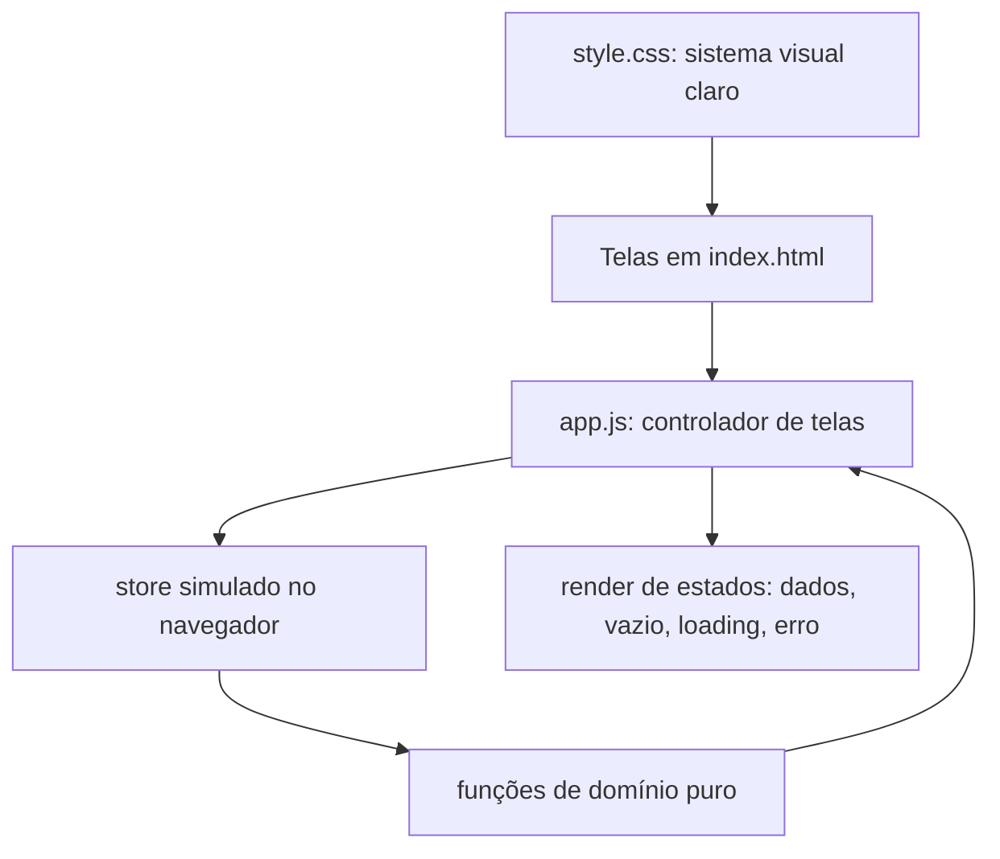

# Design — protótipo frontend de conta compartilhada

**Status:** Draft — escopo somente frontend
**Spec:** `docs/features/evolucao-conta-compartilhada/spec.md`  
**Context:** `docs/features/evolucao-conta-compartilhada/context.md`

## Objetivo do design

Descrever como o protótipo será construído usando somente o frontend estático existente (`frontend/`), sem backend, banco ou API. Todo o comportamento é simulado no navegador. O design respeita o steering de modo claro, clean, responsivo e acessível.

## Arquitetura

- `frontend/index.html`: estrutura das telas (login/cadastro, lista de viagens, viagem, resumo global).
- `frontend/app.js`: controle de sessão simulada, navegação, ações e renderização de estados.
- `frontend/style.css`: sistema visual claro, responsivo e acessível.
- Estado simulado: um "store" no navegador (memória e/ou `localStorage`) com usuários, viagens, membros, despesas, obrigações, prazos e pagamentos.
- Domínio puro: funções sem DOM para saldo, netting, transição de pagamento e regra de reset, para permitir teste isolado.

Nenhum arquivo de `backend/` é alterado por esta feature.

## Modelo de estado simulado (no navegador)

Estruturas em JavaScript, não tabelas de banco:

- `users`: `{ id, email, senhaSimulada, nome }`.
- `session`: usuário atualmente logado no protótipo.
- `trips`: `{ id, nome, ownerUserId }`.
- `memberships`: vínculo `{ tripId, userId, papel: "owner" | "member" }`.
- `expenses`: `{ id, tripId, descricao, valorCents, pagoPorUserId, participantesUserIds }`.
- `obligations`: `{ id, tripId, deUserId, paraUserId, valorCents, prazo, estado }`.
  - `estado`: `pendente | aguardando_confirmacao | concluido`.
- Persistência opcional em `localStorage` para sobreviver a reload; se reiniciar, a UI deve deixar claro.

Valores continuam em centavos inteiros e moeda BRL, por consistência com o produto.

## Componentes previstos (frontend)

| Componente | Responsabilidade | Onde |
| --- | --- | --- |
| Store simulado | Guardar e recuperar o estado no navegador | `frontend/app.js` |
| Domínio puro | Saldo, netting, transição de pagamento, regra de reset | `frontend/app.js` (funções isoláveis) |
| Sessão simulada | Cadastro, login, logout e usuário atual | `frontend/app.js` |
| Viagens e papéis | Criar viagem, listar viagens do usuário, aplicar owner/member | `frontend/app.js` |
| Despesas e obrigações | Registrar despesa, gerar obrigações, listar com estado real | `frontend/app.js` |
| Pagamento em duas etapas | Declarar pagamento e confirmar recebimento | `frontend/app.js` |
| Prazo | Definir e exibir prazo/atraso por obrigação | `frontend/app.js` |
| Reset | Apagar gastos com bloqueio e confirmação | `frontend/app.js` |
| Resumo global | Consolidar por pessoa com netting e drill-down | `frontend/app.js` |
| Sistema visual | Layout claro, responsivo, acessível e estados | `frontend/style.css`, `frontend/index.html` |

## Regras de domínio

- Saldo pendente considera apenas obrigações não concluídas.
- Netting: para cada par de pessoas, somar o que o usuário deve e o que tem a receber e exibir apenas o líquido.
- Pagamento: `pendente → aguardando_confirmacao` (ação do devedor) e `aguardando_confirmacao → concluido` (ação do recebedor); recusa volta para `pendente`.
- Prazo: comparado a uma data de referência simulada; obrigação não concluída após o prazo é "atrasada".
- Reset: só executa se nenhuma obrigação estiver `concluido`; exige confirmação; owner apenas.

## Estados de UI obrigatórios

Cada tela deve tratar: dados presentes, vazio verdadeiro, carregamento simulado, erro simulado e indisponibilidade. Nenhum estado de erro pode ser exibido como "sem dados" ou "tudo quitado".

## UX e acessibilidade

- Modo claro exclusivo, sem dark mode.
- Jornada: entrar → escolher/criar viagem → registrar despesas → acompanhar obrigações e pagamentos → ver resumo global.
- Ação primária evidente em cada tela; linguagem simples e não técnica.
- Foco visível, contraste suficiente, labels associados, alvos de toque adequados.
- Responsivo em celular, tablet e desktop, sem overflow horizontal.

## Estratégia de verificação

- Sem runner de teste frontend configurado; a verificação combina UAT manual com checagem de funções de domínio puro quando extraíveis.
- Se uma task precisar de runner automatizado, ela deve explicitar o impacto de dependência e atualizar a matriz de testes antes de adotar.
- O `git diff --check` e o `npm run build` continuam válidos como gates mecânicos, mesmo sem alterar backend.

## Riscos e mitigações

| Risco | Impacto | Mitigação |
| --- | --- | --- |
| Estado simulado inconsistente após reload | Usuário vê dados errados | Definir persistência clara e indicar reinício quando ocorrer. |
| Lógica de netting incorreta | Resumo global engana o usuário | Extrair função pura de netting e cobrir com casos opostos. |
| Estado de erro exibido como vazio | Mensagem financeira falsa | Separar explicitamente estado de erro de estado vazio na renderização. |
| Confusão entre pendente, aguardando confirmação e concluído | Pagamento parece quitado sem confirmação | Estados visuais distintos e transição controlada por papel. |
| Reset destrutivo | Perda de histórico com pagamento | Bloquear reset após conclusão e exigir confirmação. |
| Excesso de escopo para backend | Quebra o combinado frontend-only | Nenhuma task altera `backend/`; novas necessidades viram features futuras. |

## Decisão de escopo

Esta feature é intencionalmente um protótipo frontend. Backend, banco, autenticação real e persistência compartilhada são deferred e viram novas features quando o produto sair do protótipo.
